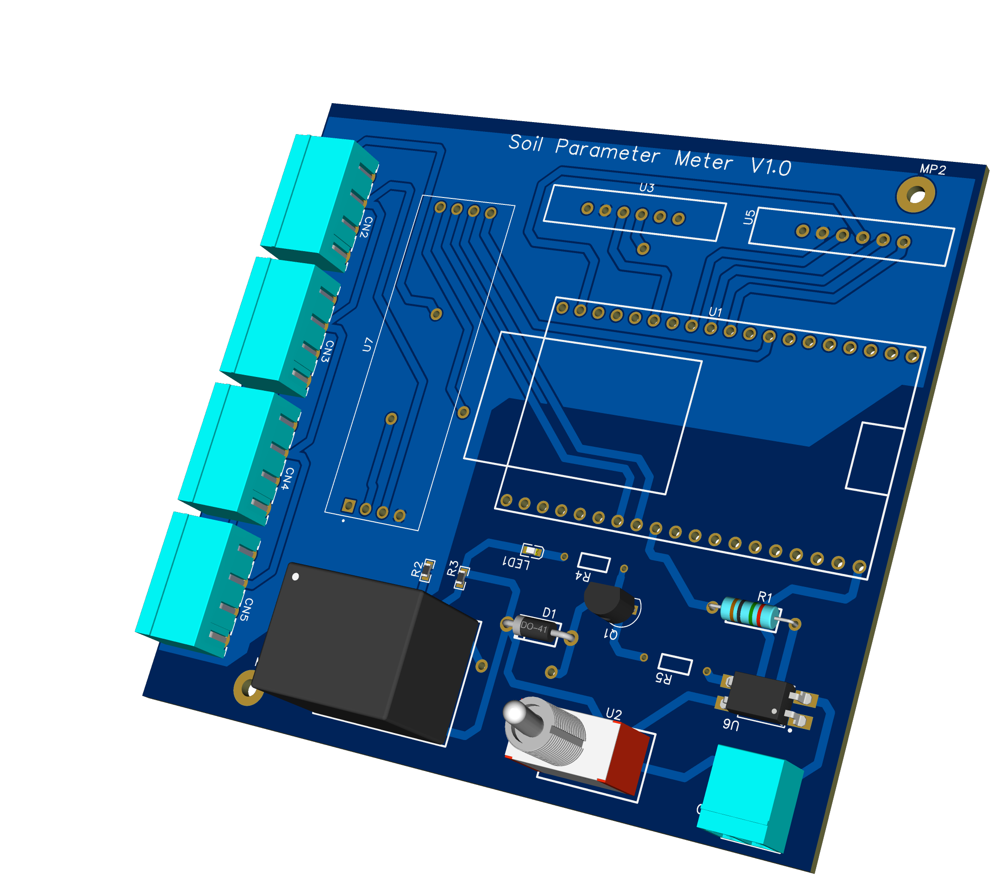
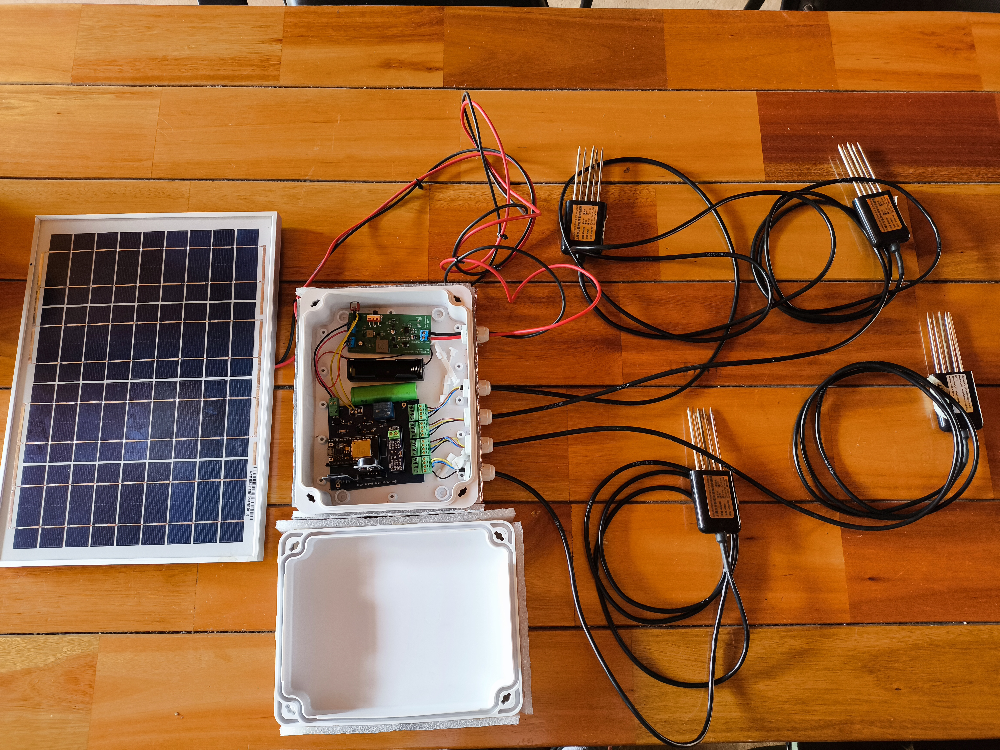

# Modular Soil Sensor Prototype

> ESP32-based modular hardware platform for soil monitoring using RS-485/Modbus sensors.

## Overview

This project presents a modular prototype developed for soil-monitoring and agricultural IoT experiments.

The platform was designed to interface with RS-ECTHPH-N01-TR-1 four-in-one soil transmitters through RS-485 and the Modbus protocol. It uses an ESP32 development board as the main controller and includes power-control and expansion interfaces for data storage and timekeeping.

This prototype was developed as an intermediate hardware platform before a later solar-powered LoRa32 prototype.

## System architecture

The prototype integrates the following main subsystems:

- ESP32 development board.
- RS-ECTHPH-N01-TR-1 four-in-one soil transmitters.
- RS-485 communication using the Modbus protocol.
- RS-485-to-TTL converter for communication with the ESP32.
- Relay circuit for switching sensor power when required.
- Headers for an external microSD-card reader.
- Headers for an external DS3231 real-time clock module.
- Modular power and sensor connections.

```text
Soil sensor
(RS-ECTHPH-N01-TR-1)
        |
     RS-485
        |
RS-485-to-TTL converter
        |
       ESP32
      /  |  \
   Relay SD  RTC
   power  DS3231
 control
```

## Main objective

The objective was to develop a flexible platform for:

- Reading soil parameters through RS-485/Modbus sensors.
- Controlling sensor power using a relay.
- Preparing the system for local data storage through a microSD card.
- Adding time information through an external DS3231 RTC.
- Testing different hardware configurations for agricultural IoT applications.

## Hardware components

| Component | Function |
|---|---|
| ESP32 development board | Main controller and data-acquisition unit |
| RS-ECTHPH-N01-TR-1 transmitter | Four-in-one soil sensor |
| RS-485 interface | Physical communication layer |
| Modbus protocol | Sensor communication protocol |
| RS-485-to-TTL converter | Interface between the sensor bus and ESP32 logic levels |
| Relay circuit | Controlled sensor power switching |
| microSD-card header | Optional local data storage |
| DS3231 header | Optional real-time clock integration |

## My contribution

- Designed the modular PCB and hardware arrangement.
- Integrated the interfaces for RS-485/Modbus soil sensors.
- Added the RS-485-to-TTL interface for communication with the ESP32.
- Designed the relay-controlled power section for the sensors.
- Added expansion headers for a microSD-card reader and an external DS3231 RTC.
- Selected and placed the main connectors and modules.
- Assembled and organized the prototype inside a protective enclosure.
- Prepared the platform for later agricultural IoT and LoRa-based development.

## Modular design approach

The PCB was designed as an experimental and expandable platform rather than as a fixed final product.

The modular arrangement made it possible to:

- Replace or add sensor modules.
- Control when the sensors receive power.
- Change the communication or processing modules.
- Add local data storage.
- Add timestamp information using an external RTC.
- Troubleshoot individual subsystems more easily.
- Reuse the hardware architecture in later prototypes.

## Prototype status

**Fabricated and assembled experimental prototype.**

The prototype was assembled using an ESP32 development board, RS-485/Modbus soil sensors, a relay-based power-control circuit, and expansion interfaces.

The board was designed to support the microSD and DS3231 modules, although the complete functionality of every optional subsystem was not necessarily tested under final operating conditions.

- RS-485 physical connection: [tested]
- Modbus communication: [tested]
- ESP32 sensor reading: [tested]
- Relay-based sensor power control: [tested]
- microSD-card interface: [tested]
- DS3231 interface: [tested]
- Complete system operation: [tested]

## Relation to later work

This prototype preceded a later hardware version designed for agricultural IoT experimentation.

The later prototype focused on:

- Solar-powered lithium-battery charging.
- A more defined enclosure and power arrangement.

This repository documents the earlier modular soil-monitoring platform and its hardware architecture.

## Project limitations

- This was an experimental research prototype.
- The design was not intended to represent a production-ready commercial device.
- Complete long-term field validation was not performed.
- Optional modules should be considered supported interfaces unless their functionality was specifically tested.
- Additional testing would be required for sensor calibration, communication reliability, power consumption, environmental protection, and long-term operation.

## Tools

- [PCB design software used]
- ESP32 development environment
- Electronic measurement and assembly tools
- Modbus/RS-485 documentation

## Media





## License

This repository is for portfolio and technical documentation purposes.

Do not manufacture, reuse, or distribute the design files without permission from the project owner.
